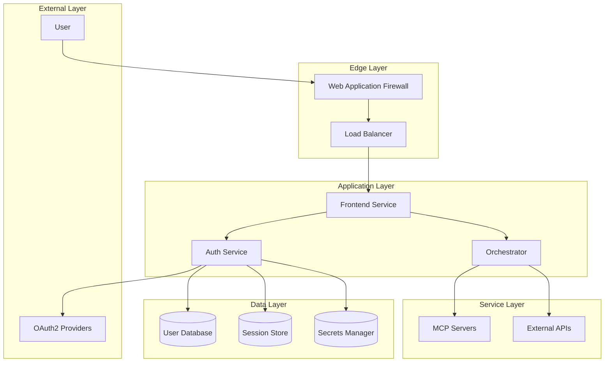
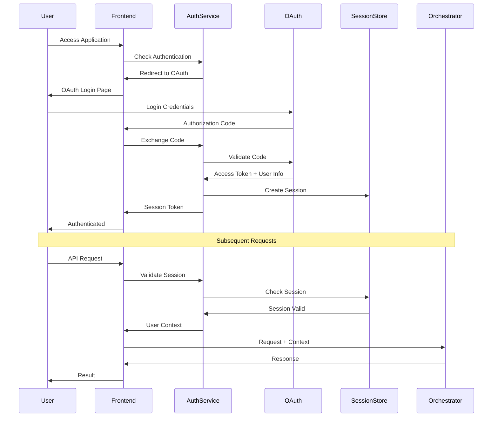

# Authentication & Security Documentation

## Table of Contents

1. [Overview](#overview)
2. [Authentication Architecture](#authentication-architecture)
3. [OAuth2 Implementation](#oauth2-implementation)
4. [JWT Token Management](#jwt-token-management)
5. [Service-to-Service Authentication](#service-to-service-authentication)
6. [Authorization Framework](#authorization-framework)
7. [Security Best Practices](#security-best-practices)
8. [Data Protection](#data-protection)
9. [Compliance & Auditing](#compliance--auditing)
10. [Security Incident Response](#security-incident-response)

## Overview

This document outlines the comprehensive security architecture for the AI Assistant system, covering authentication, authorization, data protection, and compliance requirements. The security model follows a defense-in-depth approach with multiple layers of protection.

### Security Principles

1. **Zero Trust**: Never trust, always verify
2. **Least Privilege**: Minimal necessary permissions
3. **Defense in Depth**: Multiple security layers
4. **Secure by Default**: Security enabled out of the box
5. **Audit Everything**: Comprehensive logging and monitoring

## Authentication Architecture

### Multi-Layer Authentication Model



### Authentication Flow



## OAuth2 Implementation

### OAuth2 Configuration

```python
# auth/oauth_config.py
from typing import Dict, List
from pydantic import BaseModel, HttpUrl

class OAuth2Provider(BaseModel):
    """OAuth2 provider configuration"""
    name: str
    client_id: str
    client_secret: str
    authorization_url: HttpUrl
    token_url: HttpUrl
    userinfo_url: HttpUrl
    scopes: List[str]
    redirect_uri: HttpUrl

class OAuth2Config:
    """OAuth2 configuration manager"""
    
    providers = {
        "google": OAuth2Provider(
            name="Google",
            client_id="${GOOGLE_CLIENT_ID}",
            client_secret="${GOOGLE_CLIENT_SECRET}",
            authorization_url="https://accounts.google.com/o/oauth2/v2/auth",
            token_url="https://oauth2.googleapis.com/token",
            userinfo_url="https://www.googleapis.com/oauth2/v2/userinfo",
            scopes=["openid", "profile", "email"],
            redirect_uri="${BASE_URL}/auth/callback/google"
        ),
        "github": OAuth2Provider(
            name="GitHub",
            client_id="${GITHUB_CLIENT_ID}",
            client_secret="${GITHUB_CLIENT_SECRET}",
            authorization_url="https://github.com/login/oauth/authorize",
            token_url="https://github.com/login/oauth/access_token",
            userinfo_url="https://api.github.com/user",
            scopes=["read:user", "user:email"],
            redirect_uri="${BASE_URL}/auth/callback/github"
        ),
        "microsoft": OAuth2Provider(
            name="Microsoft",
            client_id="${MICROSOFT_CLIENT_ID}",
            client_secret="${MICROSOFT_CLIENT_SECRET}",
            authorization_url="https://login.microsoftonline.com/common/oauth2/v2.0/authorize",
            token_url="https://login.microsoftonline.com/common/oauth2/v2.0/token",
            userinfo_url="https://graph.microsoft.com/v1.0/me",
            scopes=["openid", "profile", "email"],
            redirect_uri="${BASE_URL}/auth/callback/microsoft"
        )
    }
```

### OAuth2 Flow Implementation

```python
# auth/oauth_service.py
import secrets
import httpx
from datetime import datetime, timedelta
from typing import Optional, Dict, Any
from urllib.parse import urlencode
import jwt

class OAuth2Service:
    """OAuth2 authentication service"""
    
    def __init__(self, session_store, user_repository):
        self.session_store = session_store
        self.user_repo = user_repository
        self.state_store = {}  # In production, use Redis
    
    async def initiate_oauth_flow(self, provider: str) -> str:
        """Initiate OAuth2 flow"""
        if provider not in OAuth2Config.providers:
            raise ValueError(f"Unknown provider: {provider}")
        
        config = OAuth2Config.providers[provider]
        state = secrets.token_urlsafe(32)
        
        # Store state for validation
        self.state_store[state] = {
            "provider": provider,
            "created_at": datetime.utcnow(),
            "expires_at": datetime.utcnow() + timedelta(minutes=10)
        }
        
        # Build authorization URL
        params = {
            "client_id": config.client_id,
            "redirect_uri": config.redirect_uri,
            "scope": " ".join(config.scopes),
            "response_type": "code",
            "state": state,
            "access_type": "offline",  # Request refresh token
            "prompt": "consent"
        }
        
        auth_url = f"{config.authorization_url}?{urlencode(params)}"
        return auth_url
    
    async def handle_oauth_callback(
        self,
        provider: str,
        code: str,
        state: str
    ) -> Dict[str, Any]:
        """Handle OAuth2 callback"""
        # Validate state
        if state not in self.state_store:
            raise ValueError("Invalid state parameter")
        
        state_data = self.state_store[state]
        if state_data["expires_at"] < datetime.utcnow():
            raise ValueError("State expired")
        
        if state_data["provider"] != provider:
            raise ValueError("Provider mismatch")
        
        # Exchange code for tokens
        config = OAuth2Config.providers[provider]
        tokens = await self._exchange_code_for_tokens(config, code)
        
        # Get user info
        user_info = await self._get_user_info(config, tokens["access_token"])
        
        # Create or update user
        user = await self._create_or_update_user(provider, user_info, tokens)
        
        # Create session
        session = await self._create_session(user)
        
        # Clean up state
        del self.state_store[state]
        
        return {
            "user": user,
            "session": session,
            "tokens": tokens
        }
```

## JWT Token Management

### JWT Token Service

```python
# auth/jwt_service.py
import jwt
from datetime import datetime, timedelta
from typing import Dict, Any, Optional, List
import secrets
import redis

class JWTService:
    """JWT token management service"""
    
    def __init__(self, secret_key: str, redis_client, algorithm: str = "HS256"):
        self.secret_key = secret_key
        self.algorithm = algorithm
        self.redis_client = redis_client
        self.access_token_ttl = timedelta(minutes=15)
        self.refresh_token_ttl = timedelta(days=30)
    
    def create_access_token(
        self,
        user_id: str,
        email: str,
        permissions: List[str] = None
    ) -> str:
        """Create access token"""
        now = datetime.utcnow()
        payload = {
            "sub": user_id,
            "email": email,
            "permissions": permissions or [],
            "type": "access",
            "iat": now,
            "exp": now + self.access_token_ttl,
            "jti": secrets.token_hex(16)  # JWT ID for revocation
        }
        
        return jwt.encode(payload, self.secret_key, algorithm=self.algorithm)
    
    def create_refresh_token(self, user_id: str) -> str:
        """Create refresh token"""
        now = datetime.utcnow()
        payload = {
            "sub": user_id,
            "type": "refresh",
            "iat": now,
            "exp": now + self.refresh_token_ttl,
            "jti": secrets.token_hex(16)
        }
        
        return jwt.encode(payload, self.secret_key, algorithm=self.algorithm)
    
    def verify_token(self, token: str, token_type: str = "access") -> Dict[str, Any]:
        """Verify and decode token"""
        try:
            payload = jwt.decode(
                token,
                self.secret_key,
                algorithms=[self.algorithm]
            )
            
            # Verify token type
            if payload.get("type") != token_type:
                raise jwt.InvalidTokenError(f"Invalid token type: expected {token_type}")
            
            # Check if token is revoked
            if self._is_token_revoked(payload.get("jti")):
                raise jwt.InvalidTokenError("Token has been revoked")
            
            return payload
            
        except jwt.ExpiredSignatureError:
            raise ValueError("Token has expired")
        except jwt.InvalidTokenError as e:
            raise ValueError(f"Invalid token: {e}")
    
    def revoke_token(self, token: str):
        """Revoke a token"""
        try:
            payload = jwt.decode(
                token,
                self.secret_key,
                algorithms=[self.algorithm],
                options={"verify_exp": False}  # Check even expired tokens
            )
            
            jti = payload.get("jti")
            if jti:
                # Add to revocation list
                ttl = int(payload["exp"] - datetime.utcnow().timestamp())
                if ttl > 0:
                    self._add_to_revocation_list(jti, ttl)
                    
        except jwt.InvalidTokenError:
            pass  # Invalid tokens don't need revocation
    
    def _is_token_revoked(self, jti: str) -> bool:
        """Check if token is revoked"""
        return self.redis_client.exists(f"revoked:{jti}")
    
    def _add_to_revocation_list(self, jti: str, ttl: int):
        """Add token to revocation list"""
        self.redis_client.setex(f"revoked:{jti}", ttl, "1")
```

### Token Middleware

```python
# auth/middleware.py
from fastapi import Request, HTTPException, Depends
from fastapi.security import HTTPBearer, HTTPAuthorizationCredentials
from typing import Optional

security = HTTPBearer()

class AuthMiddleware:
    """Authentication middleware"""
    
    def __init__(self, jwt_service):
        self.jwt_service = jwt_service
    
    async def verify_request(
        self,
        credentials: HTTPAuthorizationCredentials = Depends(security)
    ) -> Dict[str, Any]:
        """Verify request authentication"""
        token = credentials.credentials
        
        try:
            payload = self.jwt_service.verify_token(token)
            return {
                "user_id": payload["sub"],
                "email": payload["email"],
                "permissions": payload.get("permissions", [])
            }
        except ValueError as e:
            raise HTTPException(status_code=401, detail=str(e))
    
    async def require_permission(
        self,
        permission: str,
        user_context: Dict[str, Any] = Depends(verify_request)
    ):
        """Require specific permission"""
        if permission not in user_context.get("permissions", []):
            raise HTTPException(
                status_code=403,
                detail=f"Permission '{permission}' required"
            )
        return user_context
```

## Service-to-Service Authentication

### mTLS Configuration

```python
# auth/mtls_config.py
import ssl
from pathlib import Path

class MTLSConfig:
    """Mutual TLS configuration"""
    
    def __init__(self, certs_dir: str):
        self.certs_dir = Path(certs_dir)
        self.ca_cert = self.certs_dir / "ca.crt"
        self.server_cert = self.certs_dir / "server.crt"
        self.server_key = self.certs_dir / "server.key"
        self.client_cert = self.certs_dir / "client.crt"
        self.client_key = self.certs_dir / "client.key"
    
    def create_server_context(self) -> ssl.SSLContext:
        """Create SSL context for server"""
        context = ssl.create_default_context(ssl.Purpose.CLIENT_AUTH)
        context.load_cert_chain(
            certfile=str(self.server_cert),
            keyfile=str(self.server_key)
        )
        context.load_verify_locations(cafile=str(self.ca_cert))
        context.verify_mode = ssl.CERT_REQUIRED
        return context
    
    def create_client_context(self) -> ssl.SSLContext:
        """Create SSL context for client"""
        context = ssl.create_default_context(
            ssl.Purpose.SERVER_AUTH,
            cafile=str(self.ca_cert)
        )
        context.load_cert_chain(
            certfile=str(self.client_cert),
            keyfile=str(self.client_key)
        )
        return context
```

### Service Authentication

```python
# auth/service_auth.py
import hashlib
import hmac
from datetime import datetime, timedelta
from typing import Dict, Any

class ServiceAuthenticator:
    """Service-to-service authentication"""
    
    def __init__(self, service_registry):
        self.service_registry = service_registry
        self.token_ttl = timedelta(minutes=5)
    
    def generate_service_token(
        self,
        service_id: str,
        target_service: str
    ) -> str:
        """Generate service authentication token"""
        service = self.service_registry.get_service(service_id)
        if not service:
            raise ValueError(f"Unknown service: {service_id}")
        
        timestamp = datetime.utcnow().isoformat()
        message = f"{service_id}:{target_service}:{timestamp}"
        
        # Sign message with service secret
        signature = hmac.new(
            service["secret"].encode(),
            message.encode(),
            hashlib.sha256
        ).hexdigest()
        
        return f"{message}:{signature}"
    
    def verify_service_token(
        self,
        token: str,
        expected_target: str
    ) -> Dict[str, Any]:
        """Verify service authentication token"""
        parts = token.split(":")
        if len(parts) != 4:
            raise ValueError("Invalid token format")
        
        service_id, target_service, timestamp, signature = parts
        
        # Verify target service
        if target_service != expected_target:
            raise ValueError("Token not intended for this service")
        
        # Verify timestamp
        token_time = datetime.fromisoformat(timestamp)
        if datetime.utcnow() - token_time > self.token_ttl:
            raise ValueError("Token expired")
        
        # Verify signature
        service = self.service_registry.get_service(service_id)
        if not service:
            raise ValueError(f"Unknown service: {service_id}")
        
        message = f"{service_id}:{target_service}:{timestamp}"
        expected_signature = hmac.new(
            service["secret"].encode(),
            message.encode(),
            hashlib.sha256
        ).hexdigest()
        
        if not hmac.compare_digest(signature, expected_signature):
            raise ValueError("Invalid signature")
        
        return {
            "service_id": service_id,
            "timestamp": timestamp
        }
```

## Authorization Framework

### Role-Based Access Control (RBAC)

```python
# auth/rbac.py
from typing import List, Dict, Any, Set
from enum import Enum

class Role(Enum):
    """User roles"""
    ADMIN = "admin"
    USER = "user"
    DEVELOPER = "developer"
    VIEWER = "viewer"

class Permission(Enum):
    """System permissions"""
    # Conversation permissions
    CONVERSATION_CREATE = "conversation:create"
    CONVERSATION_READ = "conversation:read"
    CONVERSATION_UPDATE = "conversation:update"
    CONVERSATION_DELETE = "conversation:delete"
    
    # Tool permissions
    TOOL_EXECUTE = "tool:execute"
    TOOL_REGISTER = "tool:register"
    TOOL_DELETE = "tool:delete"
    
    # Admin permissions
    USER_MANAGE = "user:manage"
    SYSTEM_CONFIG = "system:config"
    AUDIT_VIEW = "audit:view"

class RBACService:
    """Role-based access control service"""
    
    def __init__(self):
        self.role_permissions = {
            Role.ADMIN: set(Permission),  # All permissions
            Role.DEVELOPER: {
                Permission.CONVERSATION_CREATE,
                Permission.CONVERSATION_READ,
                Permission.CONVERSATION_UPDATE,
                Permission.CONVERSATION_DELETE,
                Permission.TOOL_EXECUTE,
                Permission.TOOL_REGISTER,
                Permission.AUDIT_VIEW
            },
            Role.USER: {
                Permission.CONVERSATION_CREATE,
                Permission.CONVERSATION_READ,
                Permission.CONVERSATION_UPDATE,
                Permission.CONVERSATION_DELETE,
                Permission.TOOL_EXECUTE
            },
            Role.VIEWER: {
                Permission.CONVERSATION_READ,
                Permission.AUDIT_VIEW
            }
        }
    
    def get_user_permissions(self, roles: List[Role]) -> Set[Permission]:
        """Get permissions for user roles"""
        permissions = set()
        for role in roles:
            permissions.update(self.role_permissions.get(role, set()))
        return permissions
    
    def check_permission(
        self,
        user_roles: List[Role],
        required_permission: Permission
    ) -> bool:
        """Check if user has required permission"""
        user_permissions = self.get_user_permissions(user_roles)
        return required_permission in user_permissions
    
    def check_resource_permission(
        self,
        user_id: str,
        resource_type: str,
        resource_id: str,
        action: str
    ) -> bool:
        """Check permission for specific resource"""
        # Implement resource-level permissions
        # e.g., check if user owns the conversation
        pass
```

### Attribute-Based Access Control (ABAC)

```python
# auth/abac.py
from typing import Dict, Any, List
import json

class ABACPolicy:
    """Attribute-based access control policy"""
    
    def __init__(self, policy_json: str):
        self.policy = json.loads(policy_json)
    
    def evaluate(
        self,
        subject: Dict[str, Any],
        resource: Dict[str, Any],
        action: str,
        environment: Dict[str, Any]
    ) -> bool:
        """Evaluate ABAC policy"""
        context = {
            "subject": subject,
            "resource": resource,
            "action": action,
            "environment": environment
        }
        
        return self._evaluate_rules(self.policy["rules"], context)
    
    def _evaluate_rules(
        self,
        rules: List[Dict[str, Any]],
        context: Dict[str, Any]
    ) -> bool:
        """Evaluate policy rules"""
        for rule in rules:
            if self._evaluate_condition(rule["condition"], context):
                return rule["effect"] == "allow"
        return False
    
    def _evaluate_condition(
        self,
        condition: Dict[str, Any],
        context: Dict[str, Any]
    ) -> bool:
        """Evaluate a single condition"""
        operator = condition.get("operator", "equals")
        attribute = condition["attribute"]
        value = condition["value"]
        
        # Get attribute value from context
        attr_value = self._get_attribute_value(attribute, context)
        
        # Evaluate based on operator
        if operator == "equals":
            return attr_value == value
        elif operator == "in":
            return attr_value in value
        elif operator == "contains":
            return value in attr_value
        elif operator == "greater_than":
            return attr_value > value
        elif operator == "less_than":
            return attr_value < value
        else:
            raise ValueError(f"Unknown operator: {operator}")
    
    def _get_attribute_value(
        self,
        attribute: str,
        context: Dict[str, Any]
    ) -> Any:
        """Get attribute value from context"""
        parts = attribute.split(".")
        value = context
        
        for part in parts:
            if isinstance(value, dict):
                value = value.get(part)
            else:
                return None
        
        return value

# Example ABAC policy
example_policy = {
    "version": "1.0",
    "rules": [
        {
            "description": "Allow users to access their own conversations",
            "condition": {
                "operator": "equals",
                "attribute": "subject.id",
                "value": "resource.owner_id"
            },
            "effect": "allow"
        },
        {
            "description": "Allow admins to access all conversations",
            "condition": {
                "operator": "in",
                "attribute": "subject.role",
                "value": ["admin"]
            },
            "effect": "allow"
        }
    ]
}
```

## Security Best Practices

### Input Validation

```python
# security/validation.py
import re
from typing import Any, Dict, List
import bleach
from pydantic import BaseModel, validator

class InputValidator:
    """Input validation service"""
    
    @staticmethod
    def sanitize_html(html: str) -> str:
        """Sanitize HTML input"""
        allowed_tags = ['b', 'i', 'u', 'em', 'strong', 'a', 'p', 'br']
        allowed_attributes = {'a': ['href', 'title']}
        
        return bleach.clean(
            html,
            tags=allowed_tags,
            attributes=allowed_attributes,
            strip=True
        )
    
    @staticmethod
    def validate_email(email: str) -> bool:
        """Validate email format"""
        pattern = r'^[a-zA-Z0-9._%+-]+@[a-zA-Z0-9.-]+\.[a-zA-Z]{2,}$'
        return bool(re.match(pattern, email))
    
    @staticmethod
    def validate_url(url: str) -> bool:
        """Validate URL format"""
        pattern = r'^https?://[a-zA-Z0-9.-]+\.[a-zA-Z]{2,}(/.*)?$'
        return bool(re.match(pattern, url))
    
    @staticmethod
    def prevent_sql_injection(query: str) -> str:
        """Prevent SQL injection"""
        # Use parameterized queries instead
        dangerous_chars = ["'", '"', ";", "--", "/*", "*/", "xp_", "sp_"]
        for char in dangerous_chars:
            if char in query.lower():
                raise ValueError("Potential SQL injection detected")
        return query

class SecureUserInput(BaseModel):
    """Secure user input model"""
    
    username: str
    email: str
    message: str
    
    @validator('username')
    def validate_username(cls, v):
        if not re.match(r'^[a-zA-Z0-9_-]{3,20}$', v):
            raise ValueError('Invalid username format')
        return v
    
    @validator('email')
    def validate_email(cls, v):
        if not InputValidator.validate_email(v):
            raise ValueError('Invalid email format')
        return v
    
    @validator('message')
    def sanitize_message(cls, v):
        return InputValidator.sanitize_html(v)
```

### Rate Limiting

```python
# security/rate_limiter.py
from datetime import datetime, timedelta
from typing import Optional
import redis
from fastapi import HTTPException

class RateLimiter:
    """Rate limiting service"""
    
    def __init__(self, redis_client):
        self.redis = redis_client
        self.default_limits = {
            "global": (1000, 3600),  # 1000 requests per hour
            "per_user": (100, 3600),  # 100 requests per hour
            "per_ip": (500, 3600),    # 500 requests per hour
            "auth": (5, 300),          # 5 auth attempts per 5 minutes
            "tool": (10, 60)           # 10 tool executions per minute
        }
    
    async def check_rate_limit(
        self,
        key: str,
        limit_type: str = "per_user"
    ) -> bool:
        """Check if request is within rate limit"""
        limit, window = self.default_limits.get(limit_type, (100, 3600))
        
        # Use sliding window counter
        now = datetime.utcnow()
        window_start = now - timedelta(seconds=window)
        
        # Remove old entries
        self.redis.zremrangebyscore(
            f"rate_limit:{key}",
            0,
            window_start.timestamp()
        )
        
        # Count requests in window
        count = self.redis.zcard(f"rate_limit:{key}")
        
        if count >= limit:
            return False
        
        # Add current request
        self.redis.zadd(
            f"rate_limit:{key}",
            {str(now.timestamp()): now.timestamp()}
        )
        self.redis.expire(f"rate_limit:{key}", window)
        
        return True
    
    async def rate_limit_middleware(
        self,
        request,
        call_next
    ):
        """Rate limiting middleware"""
        # Get client identifier
        client_id = self._get_client_id(request)
        
        # Check rate limit
        if not await self.check_rate_limit(client_id):
            raise HTTPException(
                status_code=429,
                detail="Rate limit exceeded"
            )
        
        response = await call_next(request)
        
        # Add rate limit headers
        response.headers["X-RateLimit-Limit"] = "100"
        response.headers["X-RateLimit-Remaining"] = str(
            await self._get_remaining_requests(client_id)
        )
        
        return response
```

## Data Protection

### Encryption Service

```python
# security/encryption.py
from cryptography.fernet import Fernet
from cryptography.hazmat.primitives import hashes
from cryptography.hazmat.primitives.kdf.pbkdf2 import PBKDF2
import base64
import os

class EncryptionService:
    """Data encryption service"""
    
    def __init__(self, master_key: str):
        self.master_key = master_key
        self.fernet = self._create_fernet(master_key)
    
    def _create_fernet(self, password: str) -> Fernet:
        """Create Fernet instance from password"""
        kdf = PBKDF2(
            algorithm=hashes.SHA256(),
            length=32,
            salt=b'stable_salt',  # In production, use random salt
            iterations=100000,
        )
        key = base64.urlsafe_b64encode(
            kdf.derive(password.encode())
        )
        return Fernet(key)
    
    def encrypt(self, data: str) -> str:
        """Encrypt data"""
        return self.fernet.encrypt(data.encode()).decode()
    
    def decrypt(self, encrypted_data: str) -> str:
        """Decrypt data"""
        return self.fernet.decrypt(encrypted_data.encode()).decode()
    
    def encrypt_field(self, value: Any) -> str:
        """Encrypt a field value"""
        import json
        json_str = json.dumps(value)
        return self.encrypt(json_str)
    
    def decrypt_field(self, encrypted_value: str) -> Any:
        """Decrypt a field value"""
        import json
        json_str = self.decrypt(encrypted_value)
        return json.loads(json_str)
```

### Data Masking

```python
# security/data_masking.py
import re
from typing import Any, Dict

class DataMasker:
    """Data masking service"""
    
    @staticmethod
    def mask_email(email: str) -> str:
        """Mask email address"""
        parts = email.split('@')
        if len(parts) != 2:
            return "***@***.***"
        
        username = parts[0]
        domain = parts[1]
        
        if len(username) <= 3:
            masked_username = "*" * len(username)
        else:
            masked_username = username[:2] + "*" * (len(username) - 2)
        
        return f"{masked_username}@{domain}"
    
    @staticmethod
    def mask_phone(phone: str) -> str:
        """Mask phone number"""
        # Keep only last 4 digits
        cleaned = re.sub(r'\D', '', phone)
        if len(cleaned) <= 4:
            return "*" * len(cleaned)
        return "*" * (len(cleaned) - 4) + cleaned[-4:]
    
    @staticmethod
    def mask_credit_card(card_number: str) -> str:
        """Mask credit card number"""
        cleaned = re.sub(r'\D', '', card_number)
        if len(cleaned) <= 4:
            return "*" * len(cleaned)
        return "*" * (len(cleaned) - 4) + cleaned[-4:]
    
    @staticmethod
    def mask_ssn(ssn: str) -> str:
        """Mask social security number"""
        cleaned = re.sub(r'\D', '', ssn)
        if len(cleaned) != 9:
            return "*" * len(cleaned)
        return "***-**-" + cleaned[-4:]
    
    @staticmethod
    def mask_api_key(api_key: str) -> str:
        """Mask API key"""
        if len(api_key) <= 8:
            return "*" * len(api_key)
        return api_key[:4] + "*" * (len(api_key) - 8) + api_key[-4:]
    
    @staticmethod
    def mask_dict(data: Dict[str, Any], fields_to_mask: List[str]) -> Dict[str, Any]:
        """Mask specified fields in dictionary"""
        masked_data = data.copy()
        
        for field in fields_to_mask:
            if field in masked_data:
                value = masked_data[field]
                if "email" in field.lower():
                    masked_data[field] = DataMasker.mask_email(value)
                elif "phone" in field.lower():
                    masked_data[field] = DataMasker.mask_phone(value)
                elif "card" in field.lower():
                    masked_data[field] = DataMasker.mask_credit_card(value)
                elif "ssn" in field.lower():
                    masked_data[field] = DataMasker.mask_ssn(value)
                elif "key" in field.lower() or "token" in field.lower():
                    masked_data[field] = DataMasker.mask_api_key(value)
                else:
                    # Generic masking
                    masked_data[field] = "***MASKED***"
        
        return masked_data
```

## Compliance & Auditing

### Audit Logger

```python
# audit/audit_logger.py
from datetime import datetime
from typing import Dict, Any, Optional
import json
import hashlib

class AuditLogger:
    """Audit logging service"""
    
    def __init__(self, database, encryption_service):
        self.db = database
        self.encryption = encryption_service
    
    async def log_event(
        self,
        event_type: str,
        user_id: Optional[str],
        resource_type: Optional[str],
        resource_id: Optional[str],
        action: str,
        result: str,
        details: Optional[Dict[str, Any]] = None,
        ip_address: Optional[str] = None
    ):
        """Log audit event"""
        event = {
            "id": self._generate_event_id(),
            "timestamp": datetime.utcnow().isoformat(),
            "event_type": event_type,
            "user_id": user_id,
            "resource_type": resource_type,
            "resource_id": resource_id,
            "action": action,
            "result": result,
            "details": self._sanitize_details(details),
            "ip_address": ip_address,
            "checksum": None
        }
        
        # Generate checksum for integrity
        event["checksum"] = self._generate_checksum(event)
        
        # Encrypt sensitive details
        if details and self._contains_sensitive_data(details):
            event["details"] = self.encryption.encrypt_field(details)
            event["encrypted"] = True
        
        # Store in database
        await self.db.audit_logs.insert(event)
    
    def _generate_event_id(self) -> str:
        """Generate unique event ID"""
        import uuid
        return str(uuid.uuid4())
    
    def _generate_checksum(self, event: Dict[str, Any]) -> str:
        """Generate checksum for event integrity"""
        # Remove checksum field for calculation
        event_copy = {k: v for k, v in event.items() if k != "checksum"}
        event_str = json.dumps(event_copy, sort_keys=True)
        return hashlib.sha256(event_str.encode()).hexdigest()
    
    def _sanitize_details(self, details: Optional[Dict[str, Any]]) -> Optional[Dict[str, Any]]:
        """Sanitize sensitive data in details"""
        if not details:
            return None
        
        sensitive_fields = [
            "password", "token", "secret", "api_key",
            "credit_card", "ssn", "private_key"
        ]
        
        sanitized = details.copy()
        for field in sensitive_fields:
            if field in sanitized:
                sanitized[field] = "***REDACTED***"
        
        return sanitized
    
    def _contains_sensitive_data(self, details: Dict[str, Any]) -> bool:
        """Check if details contain sensitive data"""
        sensitive_keywords = [
            "password", "token", "secret", "key",
            "card", "ssn", "private"
        ]
        
        for key in details.keys():
            if any(keyword in key.lower() for keyword in sensitive_keywords):
                return True
        
        return False

class ComplianceReporter:
    """Compliance reporting service"""
    
    def __init__(self, audit_logger):
        self.audit_logger = audit_logger
    
    async def generate_gdpr_report(self, user_id: str) -> Dict[str, Any]:
        """Generate GDPR compliance report for user"""
        # Collect all user data
        user_data = await self._collect_user_data(user_id)
        
        # Generate report
        report = {
            "user_id": user_id,
            "generated_at": datetime.utcnow().isoformat(),
            "data_categories": {
                "personal_information": user_data.get("personal", {}),
                "usage_data": user_data.get("usage", {}),
                "preferences": user_data.get("preferences", {}),
                "communications": user_data.get("communications", {})
            },
            "data_processing": {
                "purposes": [
                    "Service provision",
                    "Security and fraud prevention",
                    "Legal compliance"
                ],
                "legal_basis": "User consent",
                "retention_period": "3 years after account closure"
            },
            "third_party_sharing": {
                "shared_with": [],
                "purposes": []
            },
            "user_rights": [
                "Right to access",
                "Right to rectification",
                "Right to erasure",
                "Right to data portability",
                "Right to object"
            ]
        }
        
        return report
```

## Security Incident Response

### Incident Detection

```python
# security/incident_detection.py
from typing import List, Dict, Any
from datetime import datetime, timedelta

class SecurityMonitor:
    """Security monitoring and incident detection"""
    
    def __init__(self, alert_service, audit_logger):
        self.alert_service = alert_service
        self.audit_logger = audit_logger
        self.thresholds = {
            "failed_logins": 5,
            "rate_limit_violations": 10,
            "suspicious_patterns": 3,
            "privilege_escalations": 1
        }
    
    async def detect_brute_force(self, user_id: str) -> bool:
        """Detect brute force login attempts"""
        # Check failed login attempts in last 5 minutes
        recent_failures = await self.audit_logger.count_events(
            event_type="authentication",
            result="failure",
            user_id=user_id,
            since=datetime.utcnow() - timedelta(minutes=5)
        )
        
        if recent_failures >= self.thresholds["failed_logins"]:
            await self.trigger_incident(
                "brute_force_attempt",
                f"Multiple failed login attempts for user {user_id}",
                {"user_id": user_id, "attempts": recent_failures}
            )
            return True
        
        return False
    
    async def detect_privilege_escalation(
        self,
        user_id: str,
        requested_permission: str
    ) -> bool:
        """Detect privilege escalation attempts"""
        # Check if user is attempting to access admin functions
        admin_permissions = [
            "system:config",
            "user:manage",
            "audit:view"
        ]
        
        if requested_permission in admin_permissions:
            # Check user's actual permissions
            user_permissions = await self._get_user_permissions(user_id)
            
            if requested_permission not in user_permissions:
                await self.trigger_incident(
                    "privilege_escalation",
                    f"User {user_id} attempted unauthorized access",
                    {
                        "user_id": user_id,
                        "requested": requested_permission,
                        "actual": user_permissions
                    }
                )
                return True
        
        return False
    
    async def trigger_incident(
        self,
        incident_type: str,
        description: str,
        details: Dict[str, Any]
    ):
        """Trigger security incident response"""
        incident = {
            "id": self._generate_incident_id(),
            "type": incident_type,
            "description": description,
            "details": details,
            "timestamp": datetime.utcnow().isoformat(),
            "status": "active",
            "severity": self._calculate_severity(incident_type)
        }
        
        # Log incident
        await self.audit_logger.log_event(
            event_type="security_incident",
            user_id=details.get("user_id"),
            resource_type="system",
            resource_id=None,
            action="incident_detected",
            result="triggered",
            details=incident
        )
        
        # Send alerts
        await self.alert_service.send_security_alert(incident)
        
        # Execute automated response
        await self._execute_incident_response(incident)
    
    async def _execute_incident_response(self, incident: Dict[str, Any]):
        """Execute automated incident response"""
        incident_type = incident["type"]
        
        if incident_type == "brute_force_attempt":
            # Lock account temporarily
            user_id = incident["details"]["user_id"]
            await self._lock_account(user_id, duration=timedelta(minutes=30))
            
        elif incident_type == "privilege_escalation":
            # Revoke all tokens for user
            user_id = incident["details"]["user_id"]
            await self._revoke_user_tokens(user_id)
            
        elif incident_type == "data_breach":
            # Initiate breach protocol
            await self._initiate_breach_protocol(incident)
```

---

**Document Version**: 1.0.0  
**Last Updated**: December 2024  
**Security Standard**: OWASP Top 10 Compliant