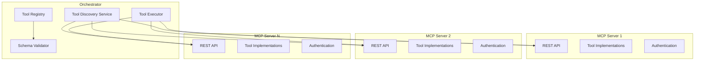
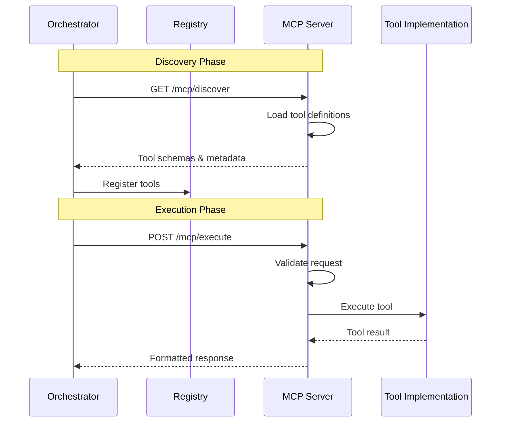

# Model Context Protocol (MCP) Integration Guide

## Table of Contents

1. [Overview](#overview)
2. [MCP Architecture](#mcp-architecture)
3. [Creating MCP Servers](#creating-mcp-servers)
4. [Tool Discovery](#tool-discovery)
5. [Tool Execution](#tool-execution)
6. [MCP Server Templates](#mcp-server-templates)
7. [Integration Patterns](#integration-patterns)
8. [Testing MCP Servers](#testing-mcp-servers)
9. [Deployment Strategies](#deployment-strategies)
10. [Best Practices](#best-practices)

## Overview

The Model Context Protocol (MCP) provides a standardized way to extend the AI Assistant's capabilities through modular tool servers. MCP servers are independent microservices that expose discoverable tools, enabling the AI to perform actions beyond language processing.

### Key Benefits

- **Modularity**: Add/remove capabilities without modifying core systems
- **Isolation**: Tools run in separate processes with independent scaling
- **Standardization**: Consistent interface for all tools
- **Discovery**: Automatic tool registration and schema validation
- **Security**: Fine-grained permissions and sandboxing

## MCP Architecture

### Conceptual Model



### MCP Communication Flow



## Creating MCP Servers

### Basic MCP Server Structure

```python
# mcp_server/main.py
from fastapi import FastAPI, HTTPException
from pydantic import BaseModel, Field
from typing import List, Dict, Any, Optional
import json

app = FastAPI(title="Example MCP Server")

# Tool definitions
TOOLS = {
    "send_email": {
        "name": "send_email",
        "description": "Send an email to specified recipients",
        "input_schema": {
            "type": "object",
            "properties": {
                "to": {
                    "type": "array",
                    "items": {"type": "string", "format": "email"},
                    "description": "Email recipients"
                },
                "subject": {
                    "type": "string",
                    "description": "Email subject"
                },
                "body": {
                    "type": "string",
                    "description": "Email body (HTML supported)"
                },
                "cc": {
                    "type": "array",
                    "items": {"type": "string", "format": "email"},
                    "description": "CC recipients",
                    "default": []
                }
            },
            "required": ["to", "subject", "body"]
        },
        "output_schema": {
            "type": "object",
            "properties": {
                "message_id": {"type": "string"},
                "status": {"type": "string"},
                "timestamp": {"type": "string", "format": "date-time"}
            }
        },
        "requires_confirmation": True,
        "rate_limit": "10/hour"
    }
}

class MCPDiscoveryResponse(BaseModel):
    server_name: str
    version: str
    description: str
    tools: List[Dict[str, Any]]
    capabilities: List[str]
    health_check_url: Optional[str] = None

class MCPExecuteRequest(BaseModel):
    tools: List[Dict[str, Any]]
    sync_response_to_workbench: bool = False
    thought: Optional[str] = None
    current_step: Optional[str] = None
    request_id: Optional[str] = None

class MCPExecuteResponse(BaseModel):
    request_id: str
    successful: bool
    data: Optional[Dict[str, Any]] = None
    error: Optional[str] = None

@app.get("/mcp/discover", response_model=MCPDiscoveryResponse)
async def discover():
    """Tool discovery endpoint"""
    return MCPDiscoveryResponse(
        server_name="email_tools",
        version="1.0.0",
        description="Email management tools",
        tools=list(TOOLS.values()),
        capabilities=["email", "notifications"],
        health_check_url="/health"
    )

@app.post("/mcp/execute", response_model=MCPExecuteResponse)
async def execute(request: MCPExecuteRequest):
    """Tool execution endpoint"""
    results = []
    
    for tool_request in request.tools:
        tool_slug = tool_request.get("tool_slug")
        arguments = tool_request.get("arguments", {})
        
        if tool_slug not in TOOLS:
            return MCPExecuteResponse(
                request_id=request.request_id or "unknown",
                successful=False,
                error=f"Tool '{tool_slug}' not found"
            )
        
        try:
            # Execute tool
            result = await execute_tool(tool_slug, arguments)
            results.append({
                "tool_slug": tool_slug,
                "response": result
            })
        except Exception as e:
            return MCPExecuteResponse(
                request_id=request.request_id or "unknown",
                successful=False,
                error=str(e)
            )
    
    return MCPExecuteResponse(
        request_id=request.request_id or "unknown",
        successful=True,
        data={"results": results}
    )

async def execute_tool(tool_slug: str, arguments: Dict[str, Any]) -> Dict[str, Any]:
    """Execute individual tool"""
    if tool_slug == "send_email":
        # Implement email sending logic
        return {
            "message_id": "msg_123abc",
            "status": "sent",
            "timestamp": "2024-01-01T00:00:00Z"
        }
    
    raise ValueError(f"Tool '{tool_slug}' not implemented")

@app.get("/health")
async def health():
    """Health check endpoint"""
    return {"status": "healthy", "timestamp": "2024-01-01T00:00:00Z"}
```

### Advanced MCP Server with Authentication

```python
# mcp_server/advanced.py
from fastapi import FastAPI, HTTPException, Depends, Header
from fastapi.security import HTTPBearer, HTTPAuthorizationCredentials
import jwt
from datetime import datetime, timedelta
import asyncio
from typing import Optional
import redis
import json

app = FastAPI(title="Advanced MCP Server")
security = HTTPBearer()
redis_client = redis.Redis(host='localhost', port=6379, decode_responses=True)

# Configuration
SECRET_KEY = "your-secret-key"
ALGORITHM = "HS256"

class ToolExecutor:
    """Base class for tool executors"""
    
    def __init__(self, tool_name: str):
        self.tool_name = tool_name
        self.rate_limiter = RateLimiter(redis_client)
    
    async def execute(self, arguments: Dict[str, Any], context: Dict[str, Any]) -> Dict[str, Any]:
        """Execute tool with rate limiting and logging"""
        # Check rate limit
        user_id = context.get("user_id", "anonymous")
        if not await self.rate_limiter.check_limit(f"{self.tool_name}:{user_id}"):
            raise HTTPException(status_code=429, detail="Rate limit exceeded")
        
        # Log execution
        await self.log_execution(user_id, arguments)
        
        # Execute tool
        return await self._execute_impl(arguments, context)
    
    async def _execute_impl(self, arguments: Dict[str, Any], context: Dict[str, Any]) -> Dict[str, Any]:
        """Override in subclasses"""
        raise NotImplementedError
    
    async def log_execution(self, user_id: str, arguments: Dict[str, Any]):
        """Log tool execution for audit"""
        log_entry = {
            "tool": self.tool_name,
            "user_id": user_id,
            "arguments": arguments,
            "timestamp": datetime.utcnow().isoformat()
        }
        redis_client.lpush("tool_executions", json.dumps(log_entry))

class EmailToolExecutor(ToolExecutor):
    """Email tool executor"""
    
    def __init__(self):
        super().__init__("send_email")
    
    async def _execute_impl(self, arguments: Dict[str, Any], context: Dict[str, Any]) -> Dict[str, Any]:
        """Send email implementation"""
        # Validate recipients
        recipients = arguments.get("to", [])
        if not recipients:
            raise ValueError("No recipients specified")
        
        # Send email (mock implementation)
        await asyncio.sleep(0.5)  # Simulate API call
        
        return {
            "message_id": f"msg_{datetime.utcnow().timestamp()}",
            "status": "sent",
            "recipients_count": len(recipients),
            "timestamp": datetime.utcnow().isoformat()
        }

class RateLimiter:
    """Redis-based rate limiter"""
    
    def __init__(self, redis_client):
        self.redis = redis_client
        self.default_limit = 100
        self.window = 3600  # 1 hour
    
    async def check_limit(self, key: str, limit: Optional[int] = None) -> bool:
        """Check if request is within rate limit"""
        limit = limit or self.default_limit
        current = self.redis.incr(key)
        
        if current == 1:
            self.redis.expire(key, self.window)
        
        return current <= limit

def verify_token(credentials: HTTPAuthorizationCredentials = Depends(security)) -> Dict[str, Any]:
    """Verify JWT token"""
    token = credentials.credentials
    try:
        payload = jwt.decode(token, SECRET_KEY, algorithms=[ALGORITHM])
        return payload
    except jwt.ExpiredSignatureError:
        raise HTTPException(status_code=401, detail="Token expired")
    except jwt.InvalidTokenError:
        raise HTTPException(status_code=401, detail="Invalid token")

# Tool registry
TOOL_EXECUTORS = {
    "send_email": EmailToolExecutor(),
    # Add more tools here
}

@app.post("/mcp/execute")
async def execute_authenticated(
    request: MCPExecuteRequest,
    auth: Dict[str, Any] = Depends(verify_token)
):
    """Authenticated tool execution"""
    context = {
        "user_id": auth.get("user_id"),
        "permissions": auth.get("permissions", [])
    }
    
    results = []
    for tool_request in request.tools:
        tool_slug = tool_request.get("tool_slug")
        arguments = tool_request.get("arguments", {})
        
        if tool_slug not in TOOL_EXECUTORS:
            return MCPExecuteResponse(
                request_id=request.request_id,
                successful=False,
                error=f"Tool '{tool_slug}' not found"
            )
        
        # Check permissions
        if f"tool:{tool_slug}" not in context["permissions"]:
            return MCPExecuteResponse(
                request_id=request.request_id,
                successful=False,
                error=f"Permission denied for tool '{tool_slug}'"
            )
        
        try:
            executor = TOOL_EXECUTORS[tool_slug]
            result = await executor.execute(arguments, context)
            results.append({
                "tool_slug": tool_slug,
                "response": result
            })
        except Exception as e:
            return MCPExecuteResponse(
                request_id=request.request_id,
                successful=False,
                error=str(e)
            )
    
    return MCPExecuteResponse(
        request_id=request.request_id,
        successful=True,
        data={"results": results}
    )
```

## Tool Discovery

### Discovery Protocol

```python
# orchestrator/discovery.py
import asyncio
import httpx
from typing import List, Dict, Any
from datetime import datetime, timedelta

class MCPDiscoveryService:
    """Service for discovering and registering MCP tools"""
    
    def __init__(self, registry):
        self.registry = registry
        self.discovered_servers = {}
        self.discovery_interval = 300  # 5 minutes
    
    async def start_discovery(self, mcp_servers: List[str]):
        """Start periodic discovery of MCP servers"""
        while True:
            await self.discover_all(mcp_servers)
            await asyncio.sleep(self.discovery_interval)
    
    async def discover_all(self, mcp_servers: List[str]):
        """Discover tools from all MCP servers"""
        tasks = [self.discover_server(server) for server in mcp_servers]
        results = await asyncio.gather(*tasks, return_exceptions=True)
        
        for server, result in zip(mcp_servers, results):
            if isinstance(result, Exception):
                print(f"Failed to discover {server}: {result}")
            else:
                await self.register_tools(server, result)
    
    async def discover_server(self, server_url: str) -> Dict[str, Any]:
        """Discover tools from a single MCP server"""
        async with httpx.AsyncClient(timeout=10.0) as client:
            response = await client.get(f"{server_url}/mcp/discover")
            response.raise_for_status()
            return response.json()
    
    async def register_tools(self, server_url: str, discovery_response: Dict[str, Any]):
        """Register discovered tools"""
        server_name = discovery_response.get("server_name")
        tools = discovery_response.get("tools", [])
        
        for tool in tools:
            tool_id = f"{server_name}:{tool['name']}"
            self.registry.register_tool(tool_id, {
                **tool,
                "server_url": server_url,
                "discovered_at": datetime.utcnow().isoformat()
            })
        
        self.discovered_servers[server_url] = {
            "name": server_name,
            "tools_count": len(tools),
            "last_discovered": datetime.utcnow()
        }

class ToolRegistry:
    """Central registry for all discovered tools"""
    
    def __init__(self):
        self.tools = {}
        self.categories = {}
    
    def register_tool(self, tool_id: str, tool_definition: Dict[str, Any]):
        """Register a tool"""
        self.tools[tool_id] = tool_definition
        
        # Categorize tool
        category = tool_definition.get("category", "general")
        if category not in self.categories:
            self.categories[category] = []
        if tool_id not in self.categories[category]:
            self.categories[category].append(tool_id)
    
    def get_tool(self, tool_id: str) -> Optional[Dict[str, Any]]:
        """Get tool definition"""
        return self.tools.get(tool_id)
    
    def list_tools(self, category: Optional[str] = None) -> List[Dict[str, Any]]:
        """List available tools"""
        if category:
            tool_ids = self.categories.get(category, [])
            return [self.tools[tid] for tid in tool_ids]
        return list(self.tools.values())
    
    def search_tools(self, query: str) -> List[Dict[str, Any]]:
        """Search tools by name or description"""
        query_lower = query.lower()
        results = []
        
        for tool_id, tool in self.tools.items():
            name = tool.get("name", "").lower()
            description = tool.get("description", "").lower()
            
            if query_lower in name or query_lower in description:
                results.append(tool)
        
        return results
```

### Dynamic Tool Loading

```python
# orchestrator/dynamic_loader.py
from typing import Dict, Any, List
import json
import jsonschema

class DynamicToolLoader:
    """Dynamically load and validate tools"""
    
    def __init__(self, registry):
        self.registry = registry
        self.validators = {}
    
    def load_tool_from_json(self, json_path: str):
        """Load tool definition from JSON file"""
        with open(json_path, 'r') as f:
            tool_def = json.load(f)
        
        self.validate_tool_definition(tool_def)
        self.registry.register_tool(tool_def['id'], tool_def)
    
    def validate_tool_definition(self, tool_def: Dict[str, Any]):
        """Validate tool definition against schema"""
        schema = {
            "type": "object",
            "required": ["id", "name", "description", "input_schema"],
            "properties": {
                "id": {"type": "string"},
                "name": {"type": "string"},
                "description": {"type": "string"},
                "category": {"type": "string"},
                "input_schema": {"type": "object"},
                "output_schema": {"type": "object"},
                "requires_confirmation": {"type": "boolean"},
                "rate_limit": {"type": "string"},
                "permissions": {
                    "type": "array",
                    "items": {"type": "string"}
                }
            }
        }
        
        jsonschema.validate(tool_def, schema)
        
        # Validate input/output schemas are valid JSON Schema
        if "input_schema" in tool_def:
            self.validate_json_schema(tool_def["input_schema"])
        if "output_schema" in tool_def:
            self.validate_json_schema(tool_def["output_schema"])
    
    def validate_json_schema(self, schema: Dict[str, Any]):
        """Validate that a schema is valid JSON Schema"""
        try:
            jsonschema.Draft7Validator.check_schema(schema)
        except jsonschema.SchemaError as e:
            raise ValueError(f"Invalid JSON Schema: {e}")
    
    def create_validator(self, tool_id: str) -> jsonschema.Validator:
        """Create a validator for tool inputs"""
        if tool_id in self.validators:
            return self.validators[tool_id]
        
        tool = self.registry.get_tool(tool_id)
        if not tool:
            raise ValueError(f"Tool '{tool_id}' not found")
        
        schema = tool.get("input_schema")
        if not schema:
            raise ValueError(f"Tool '{tool_id}' has no input schema")
        
        validator = jsonschema.Draft7Validator(schema)
        self.validators[tool_id] = validator
        return validator
```

## Tool Execution

### Execution Engine

```python
# orchestrator/executor.py
import asyncio
import httpx
from typing import Dict, Any, Optional, List
from datetime import datetime
import uuid

class ToolExecutionEngine:
    """Engine for executing tools via MCP servers"""
    
    def __init__(self, registry, auth_service):
        self.registry = registry
        self.auth_service = auth_service
        self.execution_timeout = 30.0
        self.retry_count = 3
    
    async def execute_tool(
        self,
        tool_id: str,
        arguments: Dict[str, Any],
        context: Dict[str, Any]
    ) -> Dict[str, Any]:
        """Execute a single tool"""
        tool = self.registry.get_tool(tool_id)
        if not tool:
            raise ValueError(f"Tool '{tool_id}' not found")
        
        # Validate arguments
        await self.validate_arguments(tool, arguments)
        
        # Check permissions
        if not await self.check_permissions(tool, context):
            raise PermissionError(f"Permission denied for tool '{tool_id}'")
        
        # Execute with retry
        for attempt in range(self.retry_count):
            try:
                return await self._execute_with_timeout(tool, arguments, context)
            except asyncio.TimeoutError:
                if attempt == self.retry_count - 1:
                    raise
                await asyncio.sleep(2 ** attempt)  # Exponential backoff
    
    async def _execute_with_timeout(
        self,
        tool: Dict[str, Any],
        arguments: Dict[str, Any],
        context: Dict[str, Any]
    ) -> Dict[str, Any]:
        """Execute tool with timeout"""
        server_url = tool.get("server_url")
        
        # Prepare request
        request = {
            "tools": [{
                "tool_slug": tool["name"],
                "arguments": arguments
            }],
            "request_id": str(uuid.uuid4()),
            "thought": context.get("thought"),
            "current_step": context.get("current_step")
        }
        
        # Get authentication token for MCP server
        auth_token = await self.auth_service.get_service_token(server_url)
        
        # Execute request
        async with httpx.AsyncClient(timeout=self.execution_timeout) as client:
            response = await client.post(
                f"{server_url}/mcp/execute",
                json=request,
                headers={"Authorization": f"Bearer {auth_token}"}
            )
            response.raise_for_status()
            
            result = response.json()
            if not result.get("successful"):
                raise Exception(f"Tool execution failed: {result.get('error')}")
            
            # Extract tool result
            tool_results = result.get("data", {}).get("results", [])
            if tool_results:
                return tool_results[0].get("response")
            
            raise Exception("No result returned from tool execution")
    
    async def validate_arguments(self, tool: Dict[str, Any], arguments: Dict[str, Any]):
        """Validate tool arguments against schema"""
        schema = tool.get("input_schema")
        if not schema:
            return  # No schema to validate against
        
        # Use jsonschema to validate
        import jsonschema
        try:
            jsonschema.validate(arguments, schema)
        except jsonschema.ValidationError as e:
            raise ValueError(f"Invalid arguments: {e.message}")
    
    async def check_permissions(self, tool: Dict[str, Any], context: Dict[str, Any]) -> bool:
        """Check if user has permission to execute tool"""
        required_permissions = tool.get("permissions", [])
        user_permissions = context.get("permissions", [])
        
        # Check if user has all required permissions
        return all(perm in user_permissions for perm in required_permissions)

class BatchToolExecutor:
    """Execute multiple tools in parallel or sequence"""
    
    def __init__(self, engine):
        self.engine = engine
    
    async def execute_parallel(
        self,
        tool_requests: List[Dict[str, Any]],
        context: Dict[str, Any]
    ) -> List[Dict[str, Any]]:
        """Execute multiple tools in parallel"""
        tasks = []
        for request in tool_requests:
            task = self.engine.execute_tool(
                request["tool_id"],
                request["arguments"],
                context
            )
            tasks.append(task)
        
        results = await asyncio.gather(*tasks, return_exceptions=True)
        
        # Process results
        output = []
        for request, result in zip(tool_requests, results):
            if isinstance(result, Exception):
                output.append({
                    "tool_id": request["tool_id"],
                    "success": False,
                    "error": str(result)
                })
            else:
                output.append({
                    "tool_id": request["tool_id"],
                    "success": True,
                    "result": result
                })
        
        return output
    
    async def execute_sequence(
        self,
        tool_requests: List[Dict[str, Any]],
        context: Dict[str, Any]
    ) -> List[Dict[str, Any]]:
        """Execute tools in sequence, passing results forward"""
        results = []
        previous_result = None
        
        for request in tool_requests:
            # Inject previous result if needed
            if previous_result and request.get("use_previous_result"):
                request["arguments"]["previous_result"] = previous_result
            
            try:
                result = await self.engine.execute_tool(
                    request["tool_id"],
                    request["arguments"],
                    context
                )
                results.append({
                    "tool_id": request["tool_id"],
                    "success": True,
                    "result": result
                })
                previous_result = result
            except Exception as e:
                results.append({
                    "tool_id": request["tool_id"],
                    "success": False,
                    "error": str(e)
                })
                break  # Stop sequence on error
        
        return results
```

## MCP Server Templates

### Template Generator

```python
# tools/mcp_generator.py
import os
import shutil
from pathlib import Path
from typing import Dict, Any

class MCPServerGenerator:
    """Generate MCP server from templates"""
    
    def __init__(self, templates_dir: str = "templates"):
        self.templates_dir = Path(templates_dir)
    
    def generate_server(
        self,
        name: str,
        tools: List[Dict[str, Any]],
        output_dir: str
    ):
        """Generate a new MCP server"""
        output_path = Path(output_dir) / name
        output_path.mkdir(parents=True, exist_ok=True)
        
        # Copy base template
        self._copy_template("base", output_path)
        
        # Generate tool implementations
        self._generate_tools(tools, output_path)
        
        # Generate configuration
        self._generate_config(name, tools, output_path)
        
        # Generate Dockerfile
        self._generate_dockerfile(name, output_path)
        
        print(f"MCP server generated at: {output_path}")
    
    def _copy_template(self, template_name: str, output_path: Path):
        """Copy template files"""
        template_path = self.templates_dir / template_name
        for item in template_path.iterdir():
            if item.is_file():
                shutil.copy2(item, output_path / item.name)
            elif item.is_dir():
                shutil.copytree(item, output_path / item.name)
    
    def _generate_tools(self, tools: List[Dict[str, Any]], output_path: Path):
        """Generate tool implementation files"""
        tools_dir = output_path / "tools"
        tools_dir.mkdir(exist_ok=True)
        
        for tool in tools:
            tool_file = tools_dir / f"{tool['name']}.py"
            tool_content = self._generate_tool_code(tool)
            tool_file.write_text(tool_content)
    
    def _generate_tool_code(self, tool: Dict[str, Any]) -> str:
        """Generate Python code for a tool"""
        return f'''
from typing import Dict, Any
import asyncio

class {tool['name'].title().replace('_', '')}Tool:
    """Auto-generated tool: {tool['description']}"""
    
    def __init__(self):
        self.name = "{tool['name']}"
        self.description = "{tool['description']}"
        self.schema = {tool.get('input_schema', {})}
    
    async def execute(self, arguments: Dict[str, Any]) -> Dict[str, Any]:
        """Execute the tool"""
        # TODO: Implement tool logic
        await asyncio.sleep(0.1)  # Simulate work
        
        return {{
            "status": "success",
            "message": f"Executed {{self.name}} with arguments: {{arguments}}"
        }}
'''
    
    def _generate_config(self, name: str, tools: List[Dict[str, Any]], output_path: Path):
        """Generate server configuration"""
        config = {
            "server_name": name,
            "version": "1.0.0",
            "tools": [tool['name'] for tool in tools],
            "port": 8000,
            "auth": {
                "enabled": True,
                "type": "jwt"
            }
        }
        
        config_file = output_path / "config.json"
        import json
        config_file.write_text(json.dumps(config, indent=2))
    
    def _generate_dockerfile(self, name: str, output_path: Path):
        """Generate Dockerfile"""
        dockerfile_content = f'''
FROM python:3.9-slim

WORKDIR /app

COPY requirements.txt .
RUN pip install --no-cache-dir -r requirements.txt

COPY . .

EXPOSE 8000

CMD ["uvicorn", "main:app", "--host", "0.0.0.0", "--port", "8000"]
'''
        
        dockerfile = output_path / "Dockerfile"
        dockerfile.write_text(dockerfile_content)
```

## Integration Patterns

### 1. Direct Integration Pattern

```python
# Direct integration with orchestrator
class DirectMCPIntegration:
    """Direct integration pattern for MCP servers"""
    
    def __init__(self, orchestrator):
        self.orchestrator = orchestrator
        self.tool_executor = ToolExecutionEngine(
            orchestrator.registry,
            orchestrator.auth_service
        )
    
    async def process_tool_request(
        self,
        tool_name: str,
        arguments: Dict[str, Any],
        user_context: Dict[str, Any]
    ) -> Dict[str, Any]:
        """Process tool request directly"""
        # Find tool in registry
        tool = self.orchestrator.registry.search_tools(tool_name)[0]
        
        # Execute tool
        result = await self.tool_executor.execute_tool(
            tool['id'],
            arguments,
            user_context
        )
        
        # Format response for LLM
        return {
            "tool": tool_name,
            "result": result,
            "success": True
        }
```

### 2. Queue-Based Integration Pattern

```python
# Queue-based async integration
from asyncio import Queue
import json

class QueueBasedMCPIntegration:
    """Queue-based integration for async tool execution"""
    
    def __init__(self, redis_client):
        self.redis = redis_client
        self.request_queue = "mcp:requests"
        self.response_queue = "mcp:responses"
    
    async def submit_tool_request(
        self,
        tool_name: str,
        arguments: Dict[str, Any],
        callback_url: Optional[str] = None
    ) -> str:
        """Submit tool request to queue"""
        request_id = str(uuid.uuid4())
        
        request = {
            "id": request_id,
            "tool": tool_name,
            "arguments": arguments,
            "callback_url": callback_url,
            "timestamp": datetime.utcnow().isoformat()
        }
        
        self.redis.lpush(self.request_queue, json.dumps(request))
        return request_id
    
    async def get_tool_result(self, request_id: str, timeout: int = 30) -> Optional[Dict[str, Any]]:
        """Get tool execution result"""
        end_time = datetime.utcnow() + timedelta(seconds=timeout)
        
        while datetime.utcnow() < end_time:
            # Check for result
            result_key = f"{self.response_queue}:{request_id}"
            result = self.redis.get(result_key)
            
            if result:
                self.redis.delete(result_key)
                return json.loads(result)
            
            await asyncio.sleep(0.5)
        
        return None  # Timeout
```

### 3. Event-Driven Integration Pattern

```python
# Event-driven integration using pub/sub
class EventDrivenMCPIntegration:
    """Event-driven integration pattern"""
    
    def __init__(self, event_bus):
        self.event_bus = event_bus
        self.subscribers = {}
        
        # Subscribe to tool events
        self.event_bus.subscribe("tool.requested", self.handle_tool_request)
        self.event_bus.subscribe("tool.completed", self.handle_tool_completion)
    
    async def handle_tool_request(self, event: Dict[str, Any]):
        """Handle tool request event"""
        tool_name = event.get("tool")
        arguments = event.get("arguments")
        context = event.get("context")
        
        # Execute tool
        result = await self.execute_tool(tool_name, arguments, context)
        
        # Publish completion event
        await self.event_bus.publish("tool.completed", {
            "request_id": event.get("request_id"),
            "tool": tool_name,
            "result": result
        })
    
    async def handle_tool_completion(self, event: Dict[str, Any]):
        """Handle tool completion event"""
        request_id = event.get("request_id")
        
        # Notify subscribers
        if request_id in self.subscribers:
            callback = self.subscribers[request_id]
            await callback(event)
            del self.subscribers[request_id]
```

## Testing MCP Servers

### Unit Testing

```python
# tests/test_mcp_server.py
import pytest
from httpx import AsyncClient
from fastapi.testclient import TestClient
import json

@pytest.fixture
def mcp_client():
    """Create test client"""
    from mcp_server.main import app
    return TestClient(app)

class TestMCPDiscovery:
    """Test MCP discovery endpoint"""
    
    def test_discover_returns_tools(self, mcp_client):
        """Test that discovery returns available tools"""
        response = mcp_client.get("/mcp/discover")
        assert response.status_code == 200
        
        data = response.json()
        assert "server_name" in data
        assert "tools" in data
        assert len(data["tools"]) > 0
    
    def test_discover_tool_schema(self, mcp_client):
        """Test that tools have valid schemas"""
        response = mcp_client.get("/mcp/discover")
        data = response.json()
        
        for tool in data["tools"]:
            assert "name" in tool
            assert "description" in tool
            assert "input_schema" in tool
            
            # Validate schema structure
            schema = tool["input_schema"]
            assert "type" in schema
            assert schema["type"] == "object"

class TestMCPExecution:
    """Test MCP execution endpoint"""
    
    @pytest.mark.asyncio
    async def test_execute_valid_tool(self, mcp_client):
        """Test executing a valid tool"""
        request = {
            "tools": [{
                "tool_slug": "send_email",
                "arguments": {
                    "to": ["test@example.com"],
                    "subject": "Test",
                    "body": "Test email"
                }
            }],
            "request_id": "test_123"
        }
        
        response = mcp_client.post("/mcp/execute", json=request)
        assert response.status_code == 200
        
        data = response.json()
        assert data["successful"] is True
        assert "data" in data
    
    @pytest.mark.asyncio
    async def test_execute_invalid_tool(self, mcp_client):
        """Test executing an invalid tool"""
        request = {
            "tools": [{
                "tool_slug": "nonexistent_tool",
                "arguments": {}
            }],
            "request_id": "test_456"
        }
        
        response = mcp_client.post("/mcp/execute", json=request)
        data = response.json()
        
        assert data["successful"] is False
        assert "error" in data
```

### Integration Testing

```python
# tests/test_mcp_integration.py
import asyncio
import pytest
from unittest.mock import Mock, patch

class TestMCPIntegration:
    """Test MCP integration with orchestrator"""
    
    @pytest.mark.asyncio
    async def test_tool_discovery_integration(self):
        """Test tool discovery from multiple servers"""
        discovery_service = MCPDiscoveryService(Mock())
        
        mcp_servers = [
            "http://mcp1.example.com",
            "http://mcp2.example.com"
        ]
        
        with patch.object(discovery_service, 'discover_server') as mock_discover:
            mock_discover.return_value = {
                "server_name": "test_server",
                "tools": [{
                    "name": "test_tool",
                    "description": "Test tool"
                }]
            }
            
            await discovery_service.discover_all(mcp_servers)
            
            assert mock_discover.call_count == 2
    
    @pytest.mark.asyncio
    async def test_tool_execution_with_retry(self):
        """Test tool execution with retry logic"""
        engine = ToolExecutionEngine(Mock(), Mock())
        
        # Mock tool that fails twice then succeeds
        call_count = 0
        
        async def mock_execute(*args, **kwargs):
            nonlocal call_count
            call_count += 1
            if call_count < 3:
                raise asyncio.TimeoutError()
            return {"status": "success"}
        
        with patch.object(engine, '_execute_with_timeout', mock_execute):
            result = await engine.execute_tool(
                "test_tool",
                {"arg": "value"},
                {"user_id": "test"}
            )
            
            assert result["status"] == "success"
            assert call_count == 3
```

### Contract Testing

```python
# tests/test_mcp_contract.py
import json
import jsonschema

class TestMCPContract:
    """Test MCP contract compliance"""
    
    def test_discovery_response_contract(self):
        """Test discovery response matches contract"""
        response = {
            "server_name": "test",
            "version": "1.0.0",
            "tools": [],
            "capabilities": []
        }
        
        schema = {
            "type": "object",
            "required": ["server_name", "version", "tools"],
            "properties": {
                "server_name": {"type": "string"},
                "version": {"type": "string"},
                "tools": {"type": "array"},
                "capabilities": {"type": "array"}
            }
        }
        
        jsonschema.validate(response, schema)
    
    def test_execute_request_contract(self):
        """Test execute request matches contract"""
        request = {
            "tools": [{
                "tool_slug": "test",
                "arguments": {}
            }],
            "request_id": "123"
        }
        
        schema = {
            "type": "object",
            "required": ["tools"],
            "properties": {
                "tools": {
                    "type": "array",
                    "items": {
                        "type": "object",
                        "required": ["tool_slug", "arguments"],
                        "properties": {
                            "tool_slug": {"type": "string"},
                            "arguments": {"type": "object"}
                        }
                    }
                },
                "request_id": {"type": "string"}
            }
        }
        
        jsonschema.validate(request, schema)
```

## Deployment Strategies

### Docker Deployment

```dockerfile
# Dockerfile for MCP Server
FROM python:3.9-slim

# Install system dependencies
RUN apt-get update && apt-get install -y \
    gcc \
    && rm -rf /var/lib/apt/lists/*

WORKDIR /app

# Install Python dependencies
COPY requirements.txt .
RUN pip install --no-cache-dir -r requirements.txt

# Copy application code
COPY . .

# Create non-root user
RUN useradd -m -u 1000 mcpuser && chown -R mcpuser:mcpuser /app
USER mcpuser

# Health check
HEALTHCHECK --interval=30s --timeout=3s --start-period=5s --retries=3 \
    CMD python -c "import requests; requests.get('http://localhost:8000/health')"

# Run application
CMD ["uvicorn", "main:app", "--host", "0.0.0.0", "--port", "8000"]
```

### Kubernetes Deployment

```yaml
# k8s/mcp-server-deployment.yaml
apiVersion: apps/v1
kind: Deployment
metadata:
  name: mcp-email-tools
  labels:
    app: mcp-email-tools
    type: mcp-server
spec:
  replicas: 2
  selector:
    matchLabels:
      app: mcp-email-tools
  template:
    metadata:
      labels:
        app: mcp-email-tools
        type: mcp-server
    spec:
      containers:
      - name: mcp-server
        image: mcp/email-tools:latest
        ports:
        - containerPort: 8000
        env:
        - name: REDIS_URL
          valueFrom:
            secretKeyRef:
              name: redis-secret
              key: url
        - name: AUTH_SECRET
          valueFrom:
            secretKeyRef:
              name: auth-secret
              key: secret
        resources:
          requests:
            memory: "128Mi"
            cpu: "100m"
          limits:
            memory: "256Mi"
            cpu: "200m"
        livenessProbe:
          httpGet:
            path: /health
            port: 8000
          initialDelaySeconds: 10
          periodSeconds: 10
        readinessProbe:
          httpGet:
            path: /mcp/discover
            port: 8000
          initialDelaySeconds: 5
          periodSeconds: 5
---
apiVersion: v1
kind: Service
metadata:
  name: mcp-email-tools
spec:
  selector:
    app: mcp-email-tools
  ports:
  - port: 80
    targetPort: 8000
  type: ClusterIP
```

### Auto-scaling Configuration

```yaml
# k8s/mcp-autoscaler.yaml
apiVersion: autoscaling/v2
kind: HorizontalPodAutoscaler
metadata:
  name: mcp-server-hpa
spec:
  scaleTargetRef:
    apiVersion: apps/v1
    kind: Deployment
    name: mcp-email-tools
  minReplicas: 1
  maxReplicas: 5
  metrics:
  - type: Resource
    resource:
      name: cpu
      target:
        type: Utilization
        averageUtilization: 50
  - type: Resource
    resource:
      name: memory
      target:
        type: Utilization
        averageUtilization: 70
  behavior:
    scaleDown:
      stabilizationWindowSeconds: 300
      policies:
      - type: Percent
        value: 50
        periodSeconds: 60
    scaleUp:
      stabilizationWindowSeconds: 0
      policies:
      - type: Percent
        value: 100
        periodSeconds: 15
      - type: Pods
        value: 2
        periodSeconds: 15
      selectPolicy: Max
```

## Best Practices

### 1. Tool Design Principles

- **Single Responsibility**: Each tool should do one thing well
- **Idempotency**: Tools should be safe to retry
- **Validation**: Always validate inputs against schema
- **Error Handling**: Return clear, actionable error messages
- **Documentation**: Provide comprehensive descriptions and examples

### 2. Security Best Practices

- **Authentication**: Always require authentication for tool execution
- **Authorization**: Implement fine-grained permissions
- **Input Sanitization**: Validate and sanitize all inputs
- **Rate Limiting**: Implement per-user and per-tool rate limits
- **Audit Logging**: Log all tool executions for security analysis

### 3. Performance Guidelines

- **Async Operations**: Use async/await for I/O operations
- **Connection Pooling**: Reuse connections to external services
- **Caching**: Cache tool discovery results
- **Timeouts**: Set appropriate timeouts for all operations
- **Resource Limits**: Define CPU and memory limits

### 4. Monitoring & Observability

```python
# Monitoring implementation
from prometheus_client import Counter, Histogram, Gauge
import time

# Metrics
tool_executions = Counter('mcp_tool_executions_total', 'Total tool executions', ['tool', 'status'])
tool_duration = Histogram('mcp_tool_duration_seconds', 'Tool execution duration', ['tool'])
active_tools = Gauge('mcp_active_tools', 'Number of active tool executions')

def monitor_tool_execution(tool_name: str):
    """Decorator for monitoring tool execution"""
    def decorator(func):
        async def wrapper(*args, **kwargs):
            active_tools.inc()
            start_time = time.time()
            
            try:
                result = await func(*args, **kwargs)
                tool_executions.labels(tool=tool_name, status='success').inc()
                return result
            except Exception as e:
                tool_executions.labels(tool=tool_name, status='failure').inc()
                raise
            finally:
                duration = time.time() - start_time
                tool_duration.labels(tool=tool_name).observe(duration)
                active_tools.dec()
        
        return wrapper
    return decorator
```

### 5. Development Workflow

1. **Define Tool Schema**: Start with clear input/output schemas
2. **Implement Core Logic**: Focus on the tool's primary function
3. **Add Validation**: Validate all inputs and outputs
4. **Write Tests**: Unit, integration, and contract tests
5. **Document**: Clear documentation with examples
6. **Deploy**: Use CI/CD for automated deployment
7. **Monitor**: Track performance and errors

---

**Document Version**: 1.0.0  
**Last Updated**: December 2024  
**MCP Specification**: v1.0