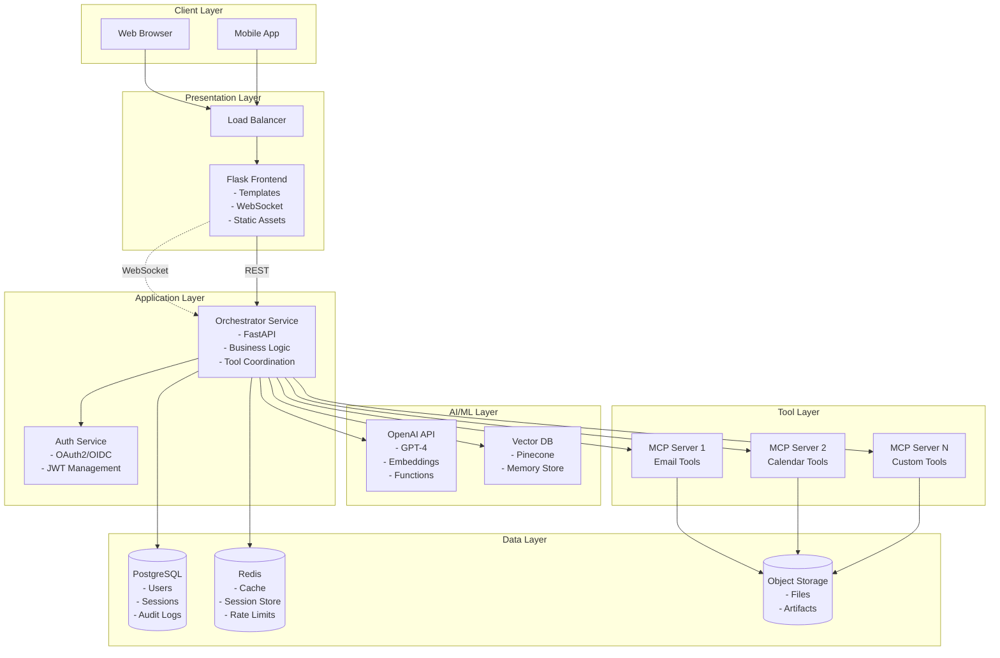
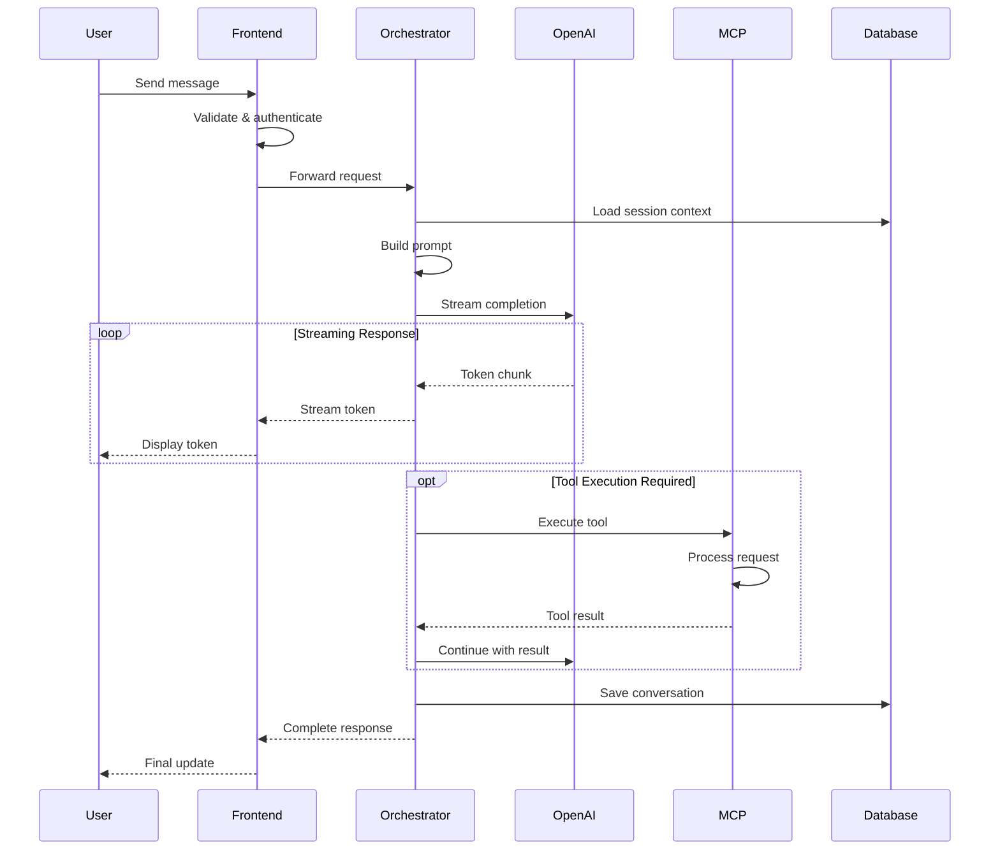
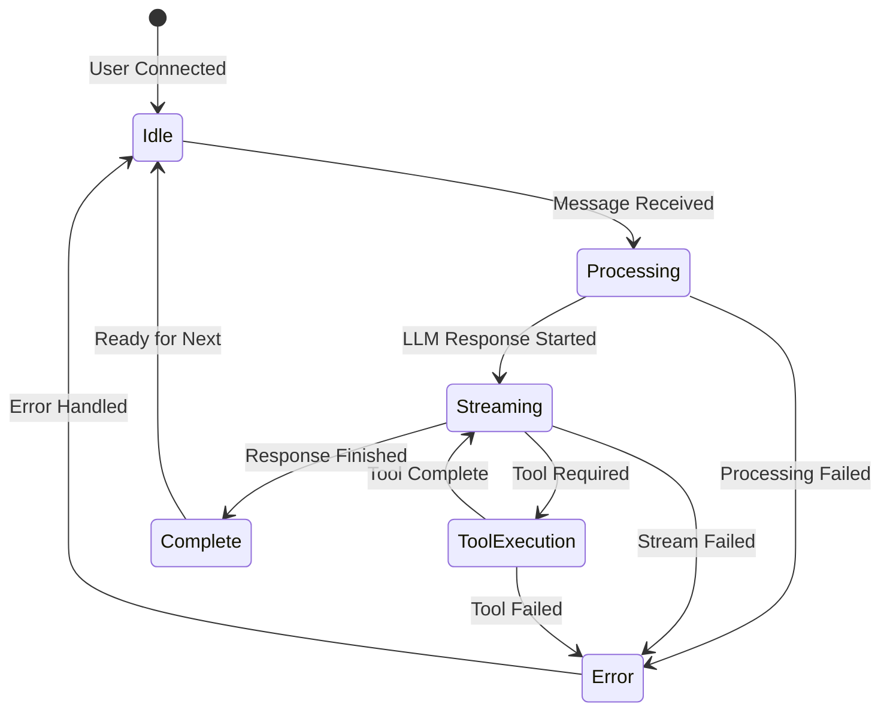
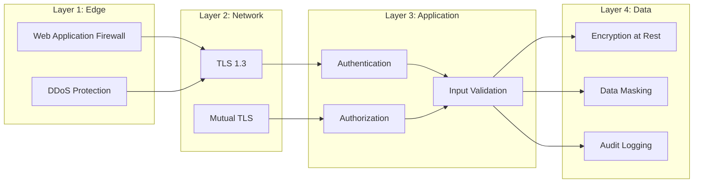
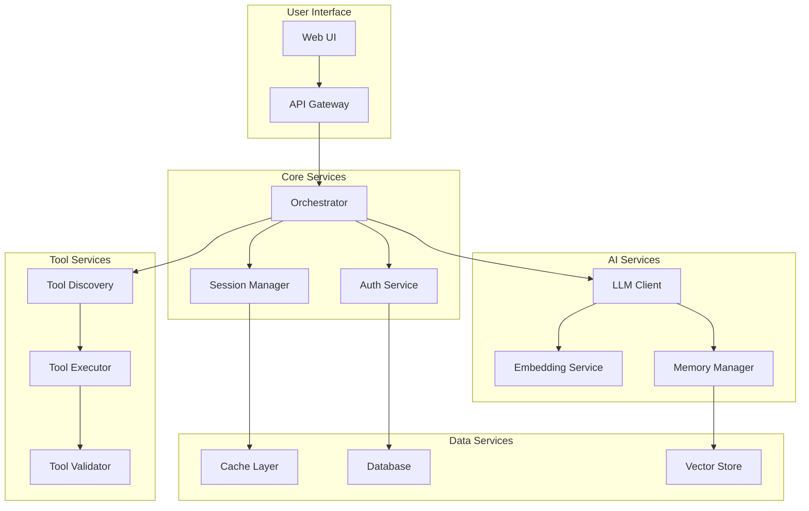
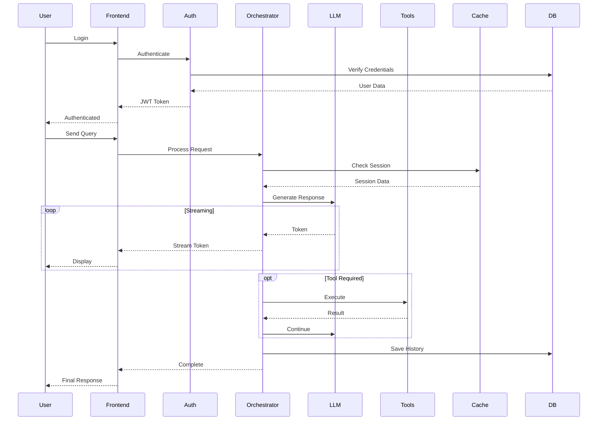

# System Architecture Documentation

## Table of Contents

1. [Executive Summary](#executive-summary)
2. [Architectural Principles](#architectural-principles)
3. [System Overview](#system-overview)
4. [Component Architecture](#component-architecture)
5. [Data Flow Architecture](#data-flow-architecture)
6. [Technology Decisions](#technology-decisions)
7. [Scalability & Performance](#scalability--performance)
8. [Security Architecture](#security-architecture)
9. [Deployment Architecture](#deployment-architecture)
10. [Architectural Diagrams](#architectural-diagrams)

## Executive Summary

This document describes the architecture of a Python-based AI Assistant system that:

- Uses OpenAI's GPT models as the core language processing engine
- Implements Model Context Protocol (MCP) for extensible tool functionality
- Provides a modern web interface with real-time streaming capabilities
- Maintains architectural simplicity while supporting modular expansion
- Ensures secure, scalable, and maintainable operations

### Key Architectural Decisions

1. **Microservices Architecture**: Clear separation between frontend, orchestration, and tool services
2. **Async-First Design**: Leveraging Python's async/await for optimal performance
3. **Event-Driven Communication**: WebSocket/SSE for real-time updates
4. **Stateless Services**: Session state externalized to Redis for horizontal scaling
5. **Contract-First Development**: Well-defined APIs between all components

## Architectural Principles

### 1. Simplicity Over Complexity

- Avoid over-engineering; use proven patterns and technologies
- Start with monolithic services, decompose when necessary
- Minimize the number of moving parts

### 2. Separation of Concerns

- Frontend handles presentation and user interaction
- Orchestrator manages business logic and AI coordination
- MCP servers provide isolated tool functionality
- Infrastructure services handle cross-cutting concerns

### 3. Extensibility Through Modularity

- MCP servers can be added/removed without core changes
- Tool discovery is dynamic and automatic
- Plugin architecture for custom functionality

### 4. Security by Design

- Zero-trust networking between services
- Principle of least privilege for all components
- Encrypted data at rest and in transit
- Comprehensive audit logging

### 5. Observable and Maintainable

- Structured logging throughout
- Distributed tracing for request flows
- Metrics for all critical operations
- Clear error messages and recovery paths

## System Overview

### High-Level Architecture



### System Boundaries

- **External Systems**: OpenAI API, OAuth providers, third-party APIs
- **Internal Services**: All custom-built services within our control
- **Edge Services**: Load balancer, CDN, WAF
- **Data Boundaries**: Clear separation between user data, system data, and temporary data

## Component Architecture

### 1. Frontend Service (Flask)

**Purpose**: Server-side rendered web interface with real-time capabilities

**Responsibilities**:

- Serve HTML templates using Jinja2
- Handle user authentication flow
- Manage WebSocket connections via Flask-SocketIO
- Serve static assets (CSS, JS, images)
- Proxy API requests to orchestrator

**Key Technologies**:

- Flask 2.3+ with Flask-SocketIO
- Jinja2 templating
- Socket.IO client library
- Tailwind CSS for styling

**Configuration**:

```python
# Frontend service configuration
class FrontendConfig:
    SECRET_KEY = os.environ['FLASK_SECRET_KEY']
    SESSION_TYPE = 'redis'
    SESSION_REDIS = redis.from_url(os.environ['REDIS_URL'])
    SOCKETIO_MESSAGE_QUEUE = os.environ['REDIS_URL']
    SOCKETIO_ASYNC_MODE = 'threading'
    MAX_CONTENT_LENGTH = 16 * 1024 * 1024  # 16MB max file size
```

### 2. Orchestrator Service (FastAPI)

**Purpose**: Core business logic and AI coordination

**Responsibilities**:

- Process user requests and manage conversation flow
- Call OpenAI API with appropriate prompts
- Discover and execute MCP tools
- Manage session state and context
- Handle rate limiting and quotas
- Stream responses back to frontend

**Key Technologies**:

- FastAPI with async/await
- OpenAI Python SDK
- httpx for async HTTP calls
- Pydantic for data validation

**Core Components**:

```python
# Orchestrator components
class OrchestratorComponents:
    """Core components of the orchestrator service"""
    
    components = {
        "request_handler": "Processes incoming requests",
        "prompt_builder": "Constructs prompts with context",
        "llm_client": "Manages OpenAI API interactions",
        "tool_executor": "Coordinates MCP tool execution",
        "session_manager": "Handles conversation state",
        "response_streamer": "Streams tokens to clients",
        "error_handler": "Manages errors and retries"
    }
```

### 3. MCP Servers

**Purpose**: Provide extensible tool functionality

**Responsibilities**:
- Expose tool discovery endpoint
- Validate tool execution requests
- Execute tools with proper error handling
- Return structured responses
- Manage tool-specific authentication

**Standard MCP Interface**:
```python
# MCP Server Interface
class MCPServer:
    @property
    def metadata(self) -> MCPMetadata:
        """Server metadata and capabilities"""
        pass
    
    @property
    def tools(self) -> List[MCPTool]:
        """Available tools with schemas"""
        pass
    
    async def discover(self) -> MCPDiscoveryResponse:
        """Tool discovery endpoint"""
        pass
    
    async def execute(self, request: MCPExecuteRequest) -> MCPExecuteResponse:
        """Tool execution endpoint"""
        pass
```

### 4. Supporting Services

**PostgreSQL Database**:
- User accounts and profiles
- Conversation history
- Tool execution logs
- Audit trails
- Configuration data

**Redis Cache**:
- Session storage
- Rate limiting counters
- Temporary conversation buffers
- Tool response cache
- Distributed locks

**Vector Database**:
- Long-term memory embeddings
- RAG document storage
- Semantic search indexes
- User preference vectors

## Data Flow Architecture

### 1. Request Flow



### 2. Streaming Architecture

**WebSocket Flow**:
```python
# WebSocket message types
class StreamMessageType(Enum):
    TOKEN = "token"              # Streaming text token
    TOOL_REQUEST = "tool_request"  # Tool execution request
    TOOL_RESULT = "tool_result"    # Tool execution result
    THINKING = "thinking"          # Model reasoning
    ERROR = "error"               # Error message
    COMPLETE = "complete"         # Stream complete
```

**Message Format**:
```json
{
    "type": "token",
    "content": "Hello",
    "metadata": {
        "token_count": 1,
        "run_id": "run_123",
        "timestamp": "2024-01-01T00:00:00Z"
    }
}
```

### 3. State Management Flow



## Technology Decisions

### Language & Framework Selection

| Component | Technology | Rationale |
|-----------|------------|-----------|
| Orchestrator | FastAPI + Python 3.9+ | Async support, automatic OpenAPI docs, high performance |
| Frontend | Flask + Jinja2 | Simple SSR, good WebSocket support, Python ecosystem |
| MCP Servers | FastAPI/Flask | Flexibility for different tool requirements |
| Database | PostgreSQL 14+ | ACID compliance, JSON support, proven reliability |
| Cache | Redis 7+ | Fast, supports pub/sub, good for sessions |
| Vector DB | Pinecone/pgvector | Depends on scale and performance needs |

### Communication Protocols

| Use Case | Protocol | Rationale |
|----------|----------|-----------|
| Client-Frontend | HTTP/WebSocket | Standard web protocols, broad support |
| Frontend-Orchestrator | HTTP/WebSocket | Internal service communication |
| Orchestrator-MCP | HTTP REST | Simple, standard, easy to implement |
| Service-to-Service Auth | mTLS/JWT | Security and flexibility |
| Pub/Sub | Redis Pub/Sub | Simple, fast, reliable for internal events |

## Scalability & Performance

### Horizontal Scaling Strategy

```yaml
# Kubernetes HPA configuration example
apiVersion: autoscaling/v2
kind: HorizontalPodAutoscaler
metadata:
  name: orchestrator-hpa
spec:
  scaleTargetRef:
    apiVersion: apps/v1
    kind: Deployment
    name: orchestrator
  minReplicas: 2
  maxReplicas: 10
  metrics:
  - type: Resource
    resource:
      name: cpu
      target:
        type: Utilization
        averageUtilization: 70
  - type: Resource
    resource:
      name: memory
      target:
        type: Utilization
        averageUtilization: 80
```

### Performance Optimization

1. **Connection Pooling**:
   - Database: 20-50 connections per service
   - Redis: 10-20 connections per service
   - HTTP: Keep-alive with connection reuse

2. **Caching Strategy**:
   - L1: In-memory cache (5-10 minutes)
   - L2: Redis cache (30-60 minutes)
   - L3: Database with indexes

3. **Rate Limiting**:
   ```python
   # Rate limiting configuration
   RATE_LIMITS = {
       "global": "100/minute",
       "per_user": "30/minute",
       "per_session": "10/minute",
       "tool_execution": "5/minute"
   }
   ```

4. **Load Balancing**:
   - Frontend: Round-robin with session affinity
   - Orchestrator: Least connections
   - MCP Servers: Health-check based routing

### Monitoring & Observability

**Metrics Collection**:
```python
# Key metrics to track
METRICS = {
    "request_duration": Histogram,
    "request_count": Counter,
    "active_sessions": Gauge,
    "token_usage": Counter,
    "tool_execution_time": Histogram,
    "error_rate": Counter,
    "cache_hit_ratio": Gauge
}
```

**Distributed Tracing**:
```python
# OpenTelemetry configuration
from opentelemetry import trace
from opentelemetry.exporter.otlp.proto.grpc.trace_exporter import OTLPSpanExporter

tracer = trace.get_tracer(__name__)

@tracer.start_as_current_span("process_request")
async def process_request(request):
    span = trace.get_current_span()
    span.set_attribute("user.id", request.user_id)
    span.set_attribute("session.id", request.session_id)
    # Process request...
```

## Security Architecture

### Defense in Depth



### Security Controls

1. **Authentication**:
   - OAuth2/OIDC for user authentication
   - API keys for service accounts
   - JWT tokens for session management

2. **Authorization**:
   - RBAC for user permissions
   - Service accounts for inter-service auth
   - Tool-specific permissions

3. **Data Protection**:
   - TLS 1.3 for all communications
   - AES-256 for data at rest
   - Key rotation every 90 days

4. **Compliance**:
   - GDPR compliance for EU users
   - SOC 2 Type II controls
   - Regular security audits

## Deployment Architecture

### Container Architecture

```dockerfile
# Multi-stage Dockerfile example
FROM python:3.9-slim as builder
WORKDIR /app
COPY requirements.txt .
RUN pip install --no-cache-dir -r requirements.txt

FROM python:3.9-slim
WORKDIR /app
COPY --from=builder /usr/local/lib/python3.9/site-packages /usr/local/lib/python3.9/site-packages
COPY . .
USER nobody
CMD ["uvicorn", "main:app", "--host", "0.0.0.0", "--port", "8000"]
```

### Kubernetes Deployment

```yaml
# Deployment configuration
apiVersion: apps/v1
kind: Deployment
metadata:
  name: orchestrator
  labels:
    app: orchestrator
spec:
  replicas: 3
  selector:
    matchLabels:
      app: orchestrator
  template:
    metadata:
      labels:
        app: orchestrator
    spec:
      containers:
      - name: orchestrator
        image: ai-assistant/orchestrator:latest
        ports:
        - containerPort: 8000
        env:
        - name: OPENAI_API_KEY
          valueFrom:
            secretKeyRef:
              name: openai-secret
              key: api-key
        resources:
          requests:
            memory: "256Mi"
            cpu: "250m"
          limits:
            memory: "512Mi"
            cpu: "500m"
        livenessProbe:
          httpGet:
            path: /health
            port: 8000
          initialDelaySeconds: 30
          periodSeconds: 10
        readinessProbe:
          httpGet:
            path: /ready
            port: 8000
          initialDelaySeconds: 5
          periodSeconds: 5
```

### CI/CD Pipeline


## Architectural Diagrams

### Component Interaction Diagram



### Data Flow Sequence



## Best Practices & Guidelines

### Development Best Practices

1. **Code Organization**:
   - Domain-driven design for service boundaries
   - Clean architecture within services
   - Dependency injection for testability

2. **API Design**:
   - RESTful principles for CRUD operations
   - GraphQL for complex queries (optional)
   - OpenAPI specification for all APIs

3. **Error Handling**:
   - Structured error responses
   - Proper HTTP status codes
   - Detailed logging without sensitive data

4. **Testing Strategy**:
   - Unit tests: 80% coverage minimum
   - Integration tests for critical paths
   - Contract tests for all APIs
   - Load tests before major releases

### Operational Best Practices

1. **Deployment**:
   - Blue-green deployments for zero downtime
   - Canary releases for gradual rollout
   - Automated rollback on failures

2. **Monitoring**:
   - Alert on symptoms, not causes
   - SLI/SLO/SLA definitions
   - Runbook for common issues

3. **Incident Response**:
   - Clear escalation path
   - Post-mortem for all incidents
   - Blameless culture

4. **Documentation**:
   - Architecture decision records (ADRs)
   - API documentation auto-generated
   - Runbooks for operations

## Conclusion

This architecture provides a robust, scalable, and maintainable foundation for an AI Assistant system. The design emphasizes:

- **Modularity**: Components can be developed and deployed independently
- **Scalability**: Horizontal scaling for all stateless services
- **Security**: Multiple layers of defense
- **Observability**: Comprehensive monitoring and tracing
- **Simplicity**: Avoiding unnecessary complexity

The architecture is designed to evolve with changing requirements while maintaining system stability and performance.

---

**Document Version**: 1.0.0  
**Last Updated**: December 2024  
**Review Cycle**: Quarterly